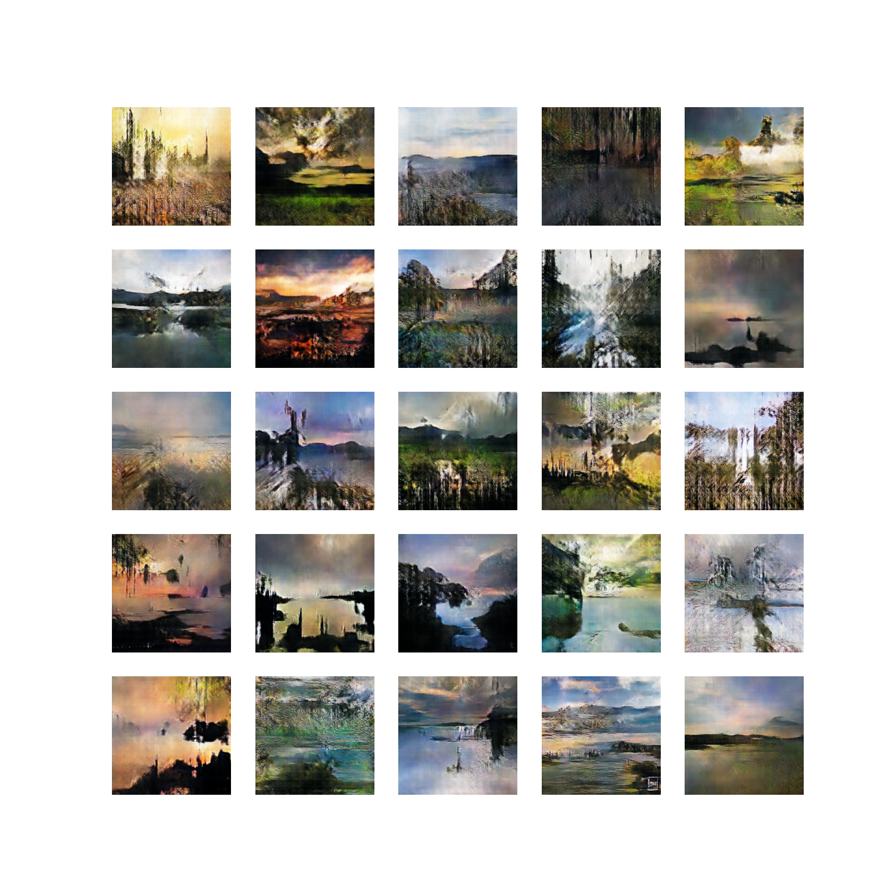
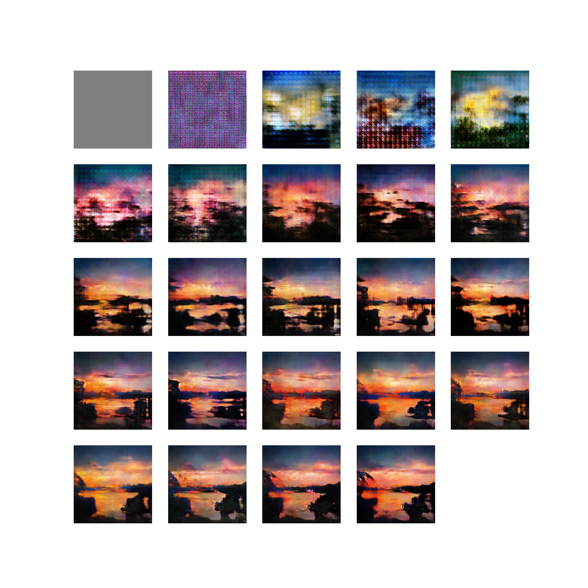
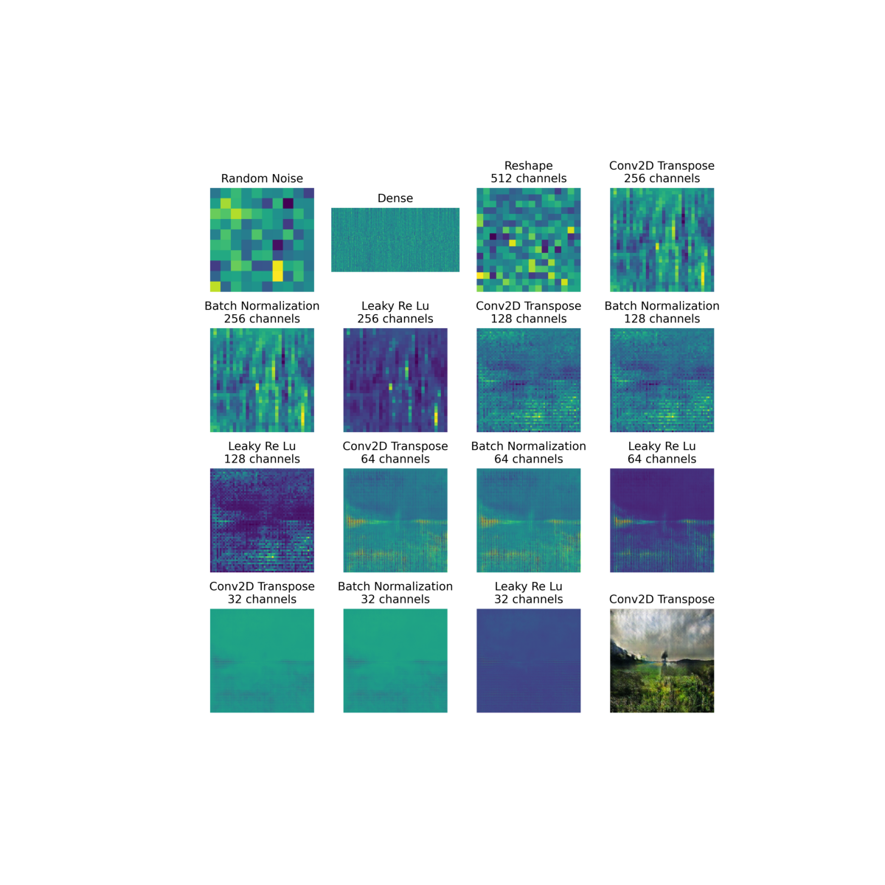

# Scenery-Image-Generation-GAN
Scenery images come to life with our model, offering realistic and engaging visuals.

# Table of Contents
1. [Examples](#examples)
2. [Training Progression](#training-progression)
3. [Model Training](#model-training)
4. [Getting Started](#getting-started)

# Examples

### Here are some images created by the image generator:  


### Same image generated from first to latest versions:


### Visualize the model creating images step by step:


# Training Progression

Below is a GIF illustrating the evolution of image quality throughout the training session.

### Fast speed


### Slower speed


### You can see the gradual enhancement in detail and complexity as the model learns and refines its output.

# Model Training

Learn about the training process for this image generation model in [training.ipynb](training.ipynb). The model was trained on Kaggle's GPU P100 over several hours.

# Getting started

To use this model, follow these steps:

1. Clone the repository
   ```bash
   git clone https://github.com/Amjuks/Scenery-Image-Generation-GAN.git
   ```

2. Install dependencies
   ```bash
   pip install -r requirements.txt
   ```

3. Import the image generator class provided and use it's various functionalities
   ```python
   from scenery_gan import SceneryGAN

   gan = SceneryGAN()

   # Optionally provide `resolution` and `visualize` parameters, to set the resolution of generated images and enable visualizing features
   gan = SceneryGAN(resolution=400, visualize=True) # Defaults to 100 and False
   ```

   ### Note
   > To display generated images on your default image viewer, always pass an argument `show=True`.  

   **Generate images**:
    ```py
    # Change 9 to any number of images
    gan.generate_images(9, show=True)
    ```

   Generate images **accross every version**:
    ```py
    gan.generate_overtime_images(show=True)

    # For 4 different images accross every version use this
    gan.generate_multiple_overtime_images(show=True)
    ```

   **Visualize** image creation:
    ```py
    gan.generate_visualizer_image(show=True)

    # Optionally provide number of images
    gan.generate_visualizer_image(4, show=True)
    ```

   GIF of **model training progress**
    ```py
    speed = 500 # default
    name = "output" # default
    directory = "scenery_gan\progress_gifs" # default

    gan.progress_gif(speed=speed, name=name, directory=directory)

    # To create a video along with the gif, set `video` to True
    gan.progress_gif(speed=speed, name=name, directory=directory, video=True)
    ```

   Use **seeds** to create same images
   ```py
    seed = gan.random_noise()

    # Notice we are passing noise
    gan.generate_images(9, show=True, noise=seed)

    # Since the seed is same, same images will be generated
    gan.generate_images(9, show=True, noise=seed)
    ```